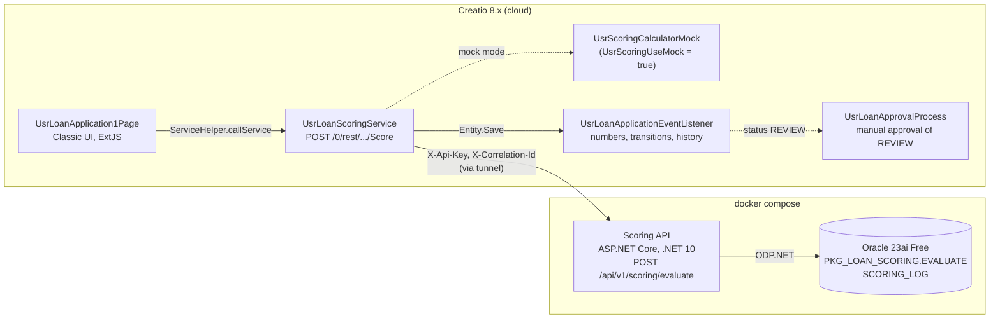

# creatio-loan-scoring

[](https://github.com/akk0sfx/oracle-loan-scoring/actions/workflows/ci.yml)

Learning project: a loan application in Creatio is scored by an ASP.NET Core (.NET 10) service that
runs the scoring algorithm as an Oracle PL/SQL package. The scenario is "loan application -> scoring ->
approval". The goal is to learn Creatio (server code and Classic UI / ExtJS) and Oracle PL/SQL
from the point of view of a .NET developer.

Russian version: [README.ru.md](README.ru.md).

## Contents

- [Architecture](#architecture)
- [Status](#status)
- [Quick start](#quick-start)
- [Scoring algorithm](#scoring-algorithm)
- [Oracle](#oracle)
- [Scoring API](#scoring-api)
- [Creatio](#creatio)
- [Tests](#tests)
- [What I learned](#what-i-learned)
- [Limitations and what I would do in production](#limitations-and-what-i-would-do-in-production)
- [Repository layout](#repository-layout)

## Architecture

All names, codes and payloads are fixed in [docs/CONTRACTS.md](docs/CONTRACTS.md); design decisions are
in [docs/DECISIONS.md](docs/DECISIONS.md), unresolved points in [docs/OPEN_QUESTIONS.md](docs/OPEN_QUESTIONS.md).



## Status

| Part | State |
|------|-------|
| Oracle schema, PL/SQL package, PL/SQL tests | done, tests green |
| Scoring API, unit and integration tests | done, tests green locally; CI configured |
| Creatio server code (service, listener, mock, API client) | written and checked locally (syntax, mock against golden vectors); not yet compiled on a stand |
| Creatio record page and client module | written and linted; not yet run on a stand |
| Approval business process, manager task, print form | not implemented |

The Creatio sources are in `creatio/src/` until the package is exported to `creatio/packages/UsrLoanScoring`.

## Quick start

Requires Docker and .NET SDK 10.

```bash
cp .env.example .env
docker compose up -d --build
```

The API starts after Oracle reports healthy (1–2 minutes on the first run).

```bash
curl -s http://localhost:8080/health
```

```bash
curl -s -X POST http://localhost:8080/api/v1/scoring/evaluate \
  -H "X-Api-Key: dev-key-change-me" -H "Content-Type: application/json" \
  -d '{"applicationId":"6f1c2b9e-0000-0000-0000-000000000001","amount":500000.00,"termMonths":24,"monthlyIncome":120000.00,"purposeCode":"CONSUMER"}'
```

```json
{"applicationId":"6f1c2b9e-0000-0000-0000-000000000001","score":800,"decision":"APPROVE","rate":19.90,
 "monthlyPayment":25423.48,"maxApprovedAmount":944000.00,"reasons":["DTI_LOW","PURPOSE_CONSUMER"],
 "evaluatedAt":"2026-10-02T12:32:43.0498302Z"}
```

All request variants: [docs/scoring-api.http](docs/scoring-api.http). OpenAPI: `http://localhost:8080/openapi/v1.json`,
UI (Development): `http://localhost:8080/scalar`.

## Scoring algorithm

Full definition: [CONTRACTS.md, section 5](docs/CONTRACTS.md). In short:

1. Estimated payment at 20% per annum (annuity) and DTI = payment / monthly income.
2. Score = 600; DTI < 0.30: +200, 0.30–0.50: +50, above: −250; term > 60: −50; amount > 3 000 000: −50;
   purpose: mortgage +50, car +30, refinancing +10, consumer 0, other −30.
3. Decision: ≥ 700 APPROVE, 500–699 REVIEW, < 500 REJECT.
4. Rate = purpose base rate − discount (2.00 for ≥ 800, 1.00 for 700–799); payment rounded to kopecks,
   half away from zero; maximum amount = amount whose payment is 40% of income, rounded down to 1000,
   capped at 5 000 000. REJECT has no rate and no payment.

The algorithm exists in four places: PL/SQL (master), C# reference in `ScoringApi.Core`, C# mock in
Creatio, JS preview on the page (base-rate preview only).

## Oracle

Oracle Database 23ai Free in Docker (`gvenzl/oracle-free:23-slim`); objects live in schema `SCORING` of
PDB `FREEPDB1`. On the first start the image runs `oracle/init/*.sql`: tables `RATE_GRID` and
`SCORING_LOG`, seed data, package `PKG_LOAN_SCORING`.

```bash
docker compose up -d oracle
```

```bash
scripts/oracle-test.sh
```

The PL/SQL tests (51 assertions, plain PL/SQL, rolled back at the end) cover the annuity, each decision,
every error -20001..-20005, the order of reasons and `GET_HISTORY` ordering. To re-run the init scripts,
drop the volume: `docker compose down -v`.

Connection for DBeaver / SQL Developer: `localhost:1521`, service name `FREEPDB1`, user `SCORING`,
password `APP_USER_PASSWORD` from `.env` (JDBC: `jdbc:oracle:thin:@//localhost:1521/FREEPDB1`).

Package API:

- `CALC_ANNUITY(amount, rate, term)` — annuity payment, not rounded.
- `EVALUATE(...)` — validates input, computes score, decision, rate, payment and maximum amount, writes a
  `SCORING_LOG` row. It does not commit: the caller owns the transaction.
- `GET_HISTORY(application_id)` — `SYS_REFCURSOR` over `SCORING_LOG`, newest first.

## Scoring API

ASP.NET Core minimal API (.NET 10), contract in [CONTRACTS.md, section 4](docs/CONTRACTS.md).

| Method | Path | Auth |
|--------|------|------|
| POST | `/api/v1/scoring/evaluate` | `X-Api-Key` |
| GET | `/api/v1/scoring/{applicationId}/history` | `X-Api-Key` |
| GET | `/health` | none |
| GET | `/openapi/v1.json` | none |

- Input is validated before the database; errors are RFC 9457 problem details with a `code` extension
  (`VALIDATION_ERROR`, `UNAUTHORIZED`, `DATABASE_UNAVAILABLE`, `INTERNAL_ERROR`).
- `X-Correlation-Id` is accepted or generated, returned and added to the logging scope.
- Configuration comes from environment variables and is validated at startup:
  `ConnectionStrings__Oracle`, `Scoring__ApiKey`. `appsettings.json` contains no secrets.

Run locally without Docker for the API (Oracle still in Docker):

```bash
docker compose up -d oracle
export ConnectionStrings__Oracle="User Id=SCORING;Password=ScoringDev123;Data Source=//localhost:1521/FREEPDB1"
export Scoring__ApiKey="dev-key-change-me"
dotnet run --project scoring-api/src/ScoringApi
```

## Creatio

Package `UsrLoanScoring`, Creatio 8.x on .NET 8, Classic UI.

| Schema | Purpose |
|--------|---------|
| `UsrLoanScoringConstants` | codes, column and setting names, status transitions, range rules |
| `UsrLoanStatusHelper` | lookup Id <-> UsrCode via EntitySchemaQuery, cache per request |
| `UsrScoringCalculatorMock` | copy of the algorithm for offline mode |
| `UsrScoringApiClient` | call to the Scoring API with timeout and error classification |
| `UsrLoanScoringService` | `POST /0/rest/UsrLoanScoringService/Score` |
| `UsrLoanApplicationEventListener` | default status, `LA-000001` numbers, allowed transitions, financial lock, decision history |
| `UsrLoanScoringClientUtils` | client module: codes, base rates, payment preview, localized error texts |
| `UsrLoanApplication1Page` | record page |
| decision history detail | status changes, newest first |

The record page shows number and status in the header, a green **Send to scoring** button for a saved
application in status New, the loan parameters with a payment preview, the read-only scoring result and
a **History** tab. Amount, term and income are validated with the contract ranges on the page and again
by the listener on the server.

Screenshots will be added after the package runs on a stand:

| | |
|---|---|
|  |  |
|  |  |

### Install the package

```bash
dotnet tool install clio -g
clio reg-web-app dev -u https://your-instance.creatio.com -l Supervisor -p "<password>"
clio push-pkg creatio/packages/UsrLoanScoring -e dev
```

Then compile the configuration (Configuration section -> Actions -> Compile). Client schemas need only a
browser reload without cache; for readable sources enable debug mode in the browser console:
`Terrasoft.SysSettings.postPersonalSysSettingsValue("IsDebug", true)`.

### System settings

| Code | Meaning |
|------|---------|
| `UsrScoringUseMock` | `true` (default): score inside Creatio, no network |
| `UsrScoringApiUrl` | public URL of the Scoring API (e.g. a tunnel) |
| `UsrScoringApiKey` | must equal `SCORING_API_KEY` from `.env` |
| `UsrScoringTimeoutSec` | timeout of the API call, default 10 |
| `UsrLoanApplicationLastNumber` | counter for `LA-000001` numbers |

To use the real API from a cloud Creatio, expose the local stack with a tunnel, for example
`cloudflared tunnel --url http://localhost:8080`, put the URL into `UsrScoringApiUrl` and set
`UsrScoringUseMock = false`. Requests for the Creatio service (login, BPMCSRF, every `errorCode`):
[docs/creatio-api.http](docs/creatio-api.http).

## Tests

```bash
dotnet test scoring-api/ScoringApi.sln --filter "Category!=Integration"
```

```bash
dotnet test scoring-api/ScoringApi.sln --filter "Category=Integration"
```

| Suite | Count | Needs | Checks |
|-------|-------|-------|--------|
| Unit | 111 | nothing | reference calculator on golden vectors, annuity and rounding, validator boundaries, Oracle error classification, the HTTP pipeline with a fake repository (JSON shape, 400/401/404/500/503, correlation id, OpenAPI) |
| Integration | 41 | Docker | real API -> ODP.NET -> PL/SQL in a Testcontainers Oracle initialized from `oracle/init` like docker-compose |
| PL/SQL | 51 assertions | running `oracle` service | the package in isolation |

**Golden vectors.** [tests/golden-vectors.json](tests/golden-vectors.json) holds 26 cases: every purpose
and decision, DTI one kopeck below and above 0.30 and 0.50, terms 6/60/61/84, amounts
50 000/3 000 000/3 000 001/5 000 000, the reachable neighbours of every score threshold, the lowest and
highest possible scores. The same file is checked against the C# reference (unit) and against Oracle
through the real API (integration), and the Creatio mock was checked against it locally. If the
implementations diverge in rounding, a threshold or the order of reasons, a test fails. Expected values
were generated by the C# reference, confirmed by an independent Python implementation
(`scripts/scoring_reference.py`) and by hand for three cases.

The tests were checked by mutation: switching the rounding to banker's rounding fails three unit tests;
changing a discount in PL/SQL fails exactly the eight golden vectors with that discount.
Some boundaries are not reachable and are therefore not tested directly: scores 499/699/799 and the clamp
to 0/1000 (the score moves in steps within 220..850), and a DTI of exactly 0.30/0.50 (income is in kopecks).

Coverage (generated code excluded):

```bash
dotnet test scoring-api/ScoringApi.sln --settings scoring-api/coverlet.runsettings --collect:"XPlat Code Coverage" --results-directory TestResults
```

## What I learned

- **Oracle packages and transactions.** Specification vs body and why changing the specification
  invalidates dependants; `RAISE_APPLICATION_ERROR` with `PRAGMA EXCEPTION_INIT` for named errors;
  leaving `COMMIT` to the caller so the API decides the transaction boundary and tests can roll back.
- **How the gvenzl image initializes a database.** Init scripts run as `SYS` in `CDB$ROOT`, not in the
  PDB where the application user lives, and `.pks`/`.pkb` files are ignored — both found by reading the
  image's entrypoint, not by guessing.
- **ODP.NET details.** `VARCHAR2` OUT parameters need an explicit size, `NUMBER` comes back as
  `OracleDecimal`, `BindByName` is off by default, and the managed driver reports a refused connection
  as `ORA-50201` with the TNS error only in the inner exception.
- **Numeric parity across languages.** `decimal` has no `Pow`; integer power by squaring keeps C# equal to
  Oracle `NUMBER` to the kopeck, while JavaScript is used only for a preview. A DTI of exactly 0.30 cannot
  be produced with income in kopecks, so boundary tests use the nearest kopeck on each side.
- **ASP.NET Core error handling.** `IExceptionHandler` with problem details; `UseExceptionHandler` clears
  response headers, so the correlation id is set in `OnStarting`; minimal APIs return an empty 400 on bad
  JSON unless `ThrowOnBadRequest` is set; `FixedTimeEquals` leaks the length unless both values are hashed.
- **Testing against a real database.** Testcontainers with the same init folder as docker-compose, one
  container per test collection, and mutation checks to confirm the tests can fail.
- **Creatio extension points (from documentation, not yet verified on a stand).** Entity event order
  (OnSaving before OnInserting/OnUpdating), configuration web services on `BaseService`, Classic UI
  `diff` operations, `bindTo`, attribute `dependencies` and AMD loading of client schemas.

## Limitations and what I would do in production

- **Number generation race.** `UsrLoanApplicationLastNumber` is read, incremented and written without a
  lock, so parallel inserts can get the same number. Production: a database sequence or a counter row
  updated atomically, plus a unique index on the number.
- **Retries and circuit breaker.** The Creatio client makes one call with a timeout; the API makes one
  call to Oracle. Production: Polly (retry with jitter for transient errors, circuit breaker so an
  Oracle outage does not hold Creatio threads for the full timeout).
- **Idempotency of scoring.** Two parallel Score calls for one application can both pass the NEW check
  and both call the API (Q-013). Production: a conditional status update (`WHERE status = NEW`) and an
  idempotency key (application id + version) on the API side.
- **Status change and HTTP call are not atomic.** The service saves SCORING, calls the API and saves
  the result; if the final rollback fails, the application stays in SCORING. Production: an outbox table
  in Creatio processed by a background job, so the status change and the scoring request are committed
  together and retried.
- **Secrets.** The API key is an encrypted Creatio system setting and an environment variable of the API;
  passwords for local runs are in `.env`. Production: a secret store (Vault / Azure Key Vault) with
  rotation, and per-client keys or mTLS instead of one shared key.
- **Audit.** History keeps status changes only. Production: an audit trail of who changed which
  financial field, linked to the correlation id of the scoring call.
- **Not implemented:** approval business process `UsrLoanApprovalProcess`, manager task, print form.
- **Open contract and platform questions** (details in [OPEN_QUESTIONS.md](docs/OPEN_QUESTIONS.md)):
  error code for an invalid rate inside the package (Q-001); whether `basePayment` is rounded before DTI
  (Q-002); a lower bound for the maximum amount (Q-003); example numbers in the contract do not match the
  algorithm (Q-004); full list of "database unavailable" codes in ODP.NET (Q-005); `code` values for 404/405
  (Q-006); time zone of `SCORING_LOG.CREATED_AT` (Q-007); Creatio platform details to confirm on a stand —
  compiler and logging on .NET 8, `SysSettings` API, record rights, `OnSaved` old values, Classic UI
  methods and containers (Q-008..Q-018).

## Repository layout

```
docs/                 CONTRACTS.md, DECISIONS.md, OPEN_QUESTIONS.md, *.http request collections
oracle/init/          schema, seed, package (run by the Oracle container on first start)
oracle/tests/         PL/SQL tests
scoring-api/          ScoringApi.sln: API, Core (reference algorithm), unit and integration tests
tests/                golden-vectors.json shared by all implementations
creatio/src/          Creatio package sources (until the package export)
scripts/              oracle-test.sh, Python reference, golden vector generator
.github/workflows/    CI: build, unit, integration, ESLint, gitleaks
```

License: [MIT](LICENSE).
