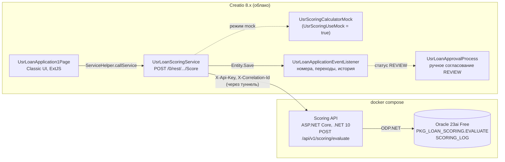

# creatio-loan-scoring

[](https://github.com/akk0sfx/oracle-loan-scoring/actions/workflows/ci.yml)

> **English summary.** A learning project: a loan application in Creatio is scored by an ASP.NET Core
> (.NET 10) service that runs the algorithm as an Oracle PL/SQL package; scenario "loan application ->
> scoring -> approval". The main documentation is in English: [README.md](README.md).

Учебный проект: кредитная заявка в Creatio проходит скоринг в сервисе на ASP.NET Core (.NET 10), который
выполняет алгоритм в PL/SQL-пакете Oracle. Сценарий — «кредитная заявка -> скоринг -> согласование».
Цель — освоить Creatio (серверный код и Classic UI / ExtJS) и Oracle PL/SQL, имея опыт в .NET.

## Содержание

- [Архитектура](#архитектура)
- [Состояние](#состояние)
- [Быстрый старт](#быстрый-старт)
- [Алгоритм скоринга](#алгоритм-скоринга)
- [Oracle](#oracle)
- [Scoring API](#scoring-api)
- [Creatio](#creatio)
- [Тесты](#тесты)
- [Что я изучил](#что-я-изучил)
- [Ограничения и что сделал бы в продакшене](#ограничения-и-что-сделал-бы-в-продакшене)
- [Структура репозитория](#структура-репозитория)

## Архитектура

Все имена, коды и форматы зафиксированы в [docs/CONTRACTS.md](docs/CONTRACTS.md), решения — в
[docs/DECISIONS.md](docs/DECISIONS.md), открытые вопросы — в [docs/OPEN_QUESTIONS.md](docs/OPEN_QUESTIONS.md).



## Состояние

| Часть | Состояние |
|-------|-----------|
| Схема Oracle, PL/SQL-пакет, PL/SQL-тесты | готово, тесты зелёные |
| Scoring API, unit- и интеграционные тесты | готово, тесты зелёные локально; CI настроен |
| Серверный код Creatio (сервис, listener, mock, клиент API) | написан и проверен локально (синтаксис, mock на golden-vectors); на стенде ещё не компилировался |
| Страница заявки и клиентский модуль Creatio | написаны и проверены линтером; на стенде ещё не запускались |
| Бизнес-процесс согласования, задача менеджера, печатная форма | не реализованы |

Исходники Creatio лежат в `creatio/src/`, пока пакет не выгружен в `creatio/packages/UsrLoanScoring`.

## Быстрый старт

Нужны Docker и .NET SDK 10.

```bash
cp .env.example .env
docker compose up -d --build
```

API стартует после того, как Oracle станет healthy (при первом запуске — 1–2 минуты).

```bash
curl -s http://localhost:8080/health
```

```bash
curl -s -X POST http://localhost:8080/api/v1/scoring/evaluate \
  -H "X-Api-Key: dev-key-change-me" -H "Content-Type: application/json" \
  -d '{"applicationId":"6f1c2b9e-0000-0000-0000-000000000001","amount":500000.00,"termMonths":24,"monthlyIncome":120000.00,"purposeCode":"CONSUMER"}'
```

```json
{"applicationId":"6f1c2b9e-0000-0000-0000-000000000001","score":800,"decision":"APPROVE","rate":19.90,
 "monthlyPayment":25423.48,"maxApprovedAmount":944000.00,"reasons":["DTI_LOW","PURPOSE_CONSUMER"],
 "evaluatedAt":"2026-10-02T12:32:43.0498302Z"}
```

Все варианты запросов: [docs/scoring-api.http](docs/scoring-api.http). OpenAPI:
`http://localhost:8080/openapi/v1.json`, интерфейс (Development): `http://localhost:8080/scalar`.

## Алгоритм скоринга

Полное описание — [CONTRACTS.md, раздел 5](docs/CONTRACTS.md). Кратко:

1. Оценочный аннуитетный платёж по ставке 20% годовых и DTI = платёж / доход в месяц.
2. Балл = 600; DTI < 0.30: +200, 0.30–0.50: +50, выше: −250; срок > 60: −50; сумма > 3 000 000: −50;
   цель: ипотека +50, автокредит +30, рефинансирование +10, потребительский 0, прочее −30.
3. Решение: ≥ 700 APPROVE, 500–699 REVIEW, < 500 REJECT.
4. Ставка = базовая ставка цели − скидка (2.00 при балле ≥ 800, 1.00 при 700–799); платёж округляется до
   копеек, половина от нуля; максимальная сумма — сумма, при которой платёж равен 40% дохода, округлённая
   вниз до 1000 и не больше 5 000 000. У REJECT нет ставки и платежа.

Алгоритм существует в четырёх местах: PL/SQL (основной), C#-эталон в `ScoringApi.Core`, C#-mock в Creatio,
JS-превью на странице (только платёж по базовой ставке).

## Oracle

Oracle Database 23ai Free в Docker (`gvenzl/oracle-free:23-slim`); объекты — в схеме `SCORING` в PDB
`FREEPDB1`. При первом запуске образ выполняет `oracle/init/*.sql`: таблицы `RATE_GRID` и `SCORING_LOG`,
справочные данные, пакет `PKG_LOAN_SCORING`.

```bash
docker compose up -d oracle
```

```bash
scripts/oracle-test.sh
```

PL/SQL-тесты (51 проверка, чистый PL/SQL, в конце ROLLBACK) покрывают аннуитет, каждое решение, каждую
ошибку -20001..-20005, порядок причин и сортировку `GET_HISTORY`. Чтобы заново выполнить init-скрипты,
удалите volume: `docker compose down -v`.

Подключение из DBeaver / SQL Developer: `localhost:1521`, service name `FREEPDB1`, пользователь `SCORING`,
пароль — `APP_USER_PASSWORD` из `.env` (JDBC: `jdbc:oracle:thin:@//localhost:1521/FREEPDB1`).

API пакета:

- `CALC_ANNUITY(amount, rate, term)` — аннуитетный платёж без округления.
- `EVALUATE(...)` — проверяет вход, считает балл, решение, ставку, платёж и максимальную сумму, пишет строку
  в `SCORING_LOG`. COMMIT не делает: транзакцией управляет вызывающая сторона.
- `GET_HISTORY(application_id)` — `SYS_REFCURSOR` по `SCORING_LOG`, новые сверху.

## Scoring API

Minimal API на ASP.NET Core (.NET 10), контракт — [CONTRACTS.md, раздел 4](docs/CONTRACTS.md).

| Метод | Путь | Аутентификация |
|-------|------|----------------|
| POST | `/api/v1/scoring/evaluate` | `X-Api-Key` |
| GET | `/api/v1/scoring/{applicationId}/history` | `X-Api-Key` |
| GET | `/health` | нет |
| GET | `/openapi/v1.json` | нет |

- Вход проверяется до обращения к БД; ошибки — RFC 9457 problem details с расширением `code`
  (`VALIDATION_ERROR`, `UNAUTHORIZED`, `DATABASE_UNAVAILABLE`, `INTERNAL_ERROR`).
- `X-Correlation-Id` принимается или генерируется, возвращается в ответе и попадает в scope логов.
- Конфигурация — из переменных окружения, проверяется при старте: `ConnectionStrings__Oracle`,
  `Scoring__ApiKey`. В `appsettings.json` секретов нет.

Запуск API без Docker (Oracle по-прежнему в Docker):

```bash
docker compose up -d oracle
export ConnectionStrings__Oracle="User Id=SCORING;Password=ScoringDev123;Data Source=//localhost:1521/FREEPDB1"
export Scoring__ApiKey="dev-key-change-me"
dotnet run --project scoring-api/src/ScoringApi
```

## Creatio

Пакет `UsrLoanScoring`, Creatio 8.x на .NET 8, Classic UI.

| Схема | Назначение |
|-------|------------|
| `UsrLoanScoringConstants` | коды, имена колонок и настроек, переходы статусов, правила диапазонов |
| `UsrLoanStatusHelper` | Id справочника <-> UsrCode через EntitySchemaQuery, кэш на запрос |
| `UsrScoringCalculatorMock` | копия алгоритма для режима без сети |
| `UsrScoringApiClient` | вызов Scoring API с таймаутом и классификацией ошибок |
| `UsrLoanScoringService` | `POST /0/rest/UsrLoanScoringService/Score` |
| `UsrLoanApplicationEventListener` | статус по умолчанию, номера `LA-000001`, допустимые переходы, блокировка финансовых полей, история решений |
| `UsrLoanScoringClientUtils` | клиентский модуль: коды, базовые ставки, превью платежа, локализованные тексты ошибок |
| `UsrLoanApplication1Page` | страница записи |
| деталь истории решений | смены статуса, новые сверху |

На странице заявки: номер и статус в шапке, зелёная кнопка **«Отправить на скоринг»** для сохранённой
заявки в статусе «Новая», параметры кредита с превью платежа, результат скоринга только для чтения и
вкладка **«История»**. Сумма, срок и доход проверяются по диапазонам контракта на странице и ещё раз на
сервере в listener.

Скриншоты будут добавлены после запуска пакета на стенде:

| | |
|---|---|
|  |  |
|  |  |

### Установка пакета

```bash
dotnet tool install clio -g
clio reg-web-app dev -u https://your-instance.creatio.com -l Supervisor -p "<password>"
clio push-pkg creatio/packages/UsrLoanScoring -e dev
```

Затем скомпилируйте конфигурацию («Конфигурация» -> «Действия» -> «Компилировать»). Клиентским схемам
достаточно перезагрузки браузера без кэша; для читаемых исходников включите режим отладки в консоли
браузера: `Terrasoft.SysSettings.postPersonalSysSettingsValue("IsDebug", true)`.

### Системные настройки

| Код | Значение |
|-----|----------|
| `UsrScoringUseMock` | `true` (по умолчанию): скоринг внутри Creatio, без сети |
| `UsrScoringApiUrl` | публичный адрес Scoring API (например, туннель) |
| `UsrScoringApiKey` | должен совпадать с `SCORING_API_KEY` из `.env` |
| `UsrScoringTimeoutSec` | таймаут вызова API, по умолчанию 10 |
| `UsrLoanApplicationLastNumber` | счётчик номеров `LA-000001` |

Чтобы облачный Creatio обращался к настоящему API, откройте локальный стенд через туннель, например
`cloudflared tunnel --url http://localhost:8080`, укажите адрес в `UsrScoringApiUrl` и установите
`UsrScoringUseMock = false`. Запросы к сервису Creatio (вход, BPMCSRF, каждый `errorCode`):
[docs/creatio-api.http](docs/creatio-api.http).

## Тесты

```bash
dotnet test scoring-api/ScoringApi.sln --filter "Category!=Integration"
```

```bash
dotnet test scoring-api/ScoringApi.sln --filter "Category=Integration"
```

| Набор | Количество | Требует | Проверяет |
|-------|------------|---------|-----------|
| Unit | 111 | ничего | C#-эталон на golden-vectors, аннуитет и округление, границы валидатора, классификацию ошибок Oracle, HTTP-конвейер с fake-репозиторием (форма JSON, 400/401/404/500/503, correlation id, OpenAPI) |
| Интеграционные | 41 | Docker | настоящий API -> ODP.NET -> PL/SQL в Oracle из Testcontainers, инициализированном из `oracle/init`, как в docker-compose |
| PL/SQL | 51 проверка | запущенный сервис `oracle` | пакет изолированно |

**Golden vectors.** В [tests/golden-vectors.json](tests/golden-vectors.json) 26 эталонных случаев: все цели
и решения, DTI на копейку ниже и выше 0.30 и 0.50, сроки 6/60/61/84, суммы 50 000/3 000 000/3 000 001/5 000 000,
достижимые соседи каждого порога балла, минимальный и максимальный возможный балл. Один и тот же файл
проверяется C#-эталоном (unit) и Oracle через настоящий API (интеграционные), а mock Creatio проверен по
нему локально. Если реализации разойдутся в округлении, пороге или порядке причин, тест упадёт. Ожидаемые
значения сгенерированы C#-эталоном, подтверждены независимой реализацией на Python
(`scripts/scoring_reference.py`) и вручную для трёх случаев.

Тесты проверены мутациями: замена округления на банковское роняет три unit-теста; изменение скидки в
PL/SQL роняет ровно восемь golden-векторов с этой скидкой. Часть границ недостижима и поэтому напрямую не
тестируется: баллы 499/699/799 и clamp до 0/1000 (балл меняется шагами в диапазоне 220..850) и DTI ровно
0.30/0.50 (доход задаётся в копейках).

Покрытие (без сгенерированного кода):

```bash
dotnet test scoring-api/ScoringApi.sln --settings scoring-api/coverlet.runsettings --collect:"XPlat Code Coverage" --results-directory TestResults
```

## Что я изучил

- **Пакеты Oracle и транзакции.** Спецификация и тело, и почему изменение спецификации инвалидирует
  зависимые объекты; `RAISE_APPLICATION_ERROR` с `PRAGMA EXCEPTION_INIT` для именованных ошибок; COMMIT
  на стороне вызывающего, чтобы границу транзакции задавал API, а тесты могли откатиться.
- **Как образ gvenzl инициализирует БД.** Init-скрипты выполняются от `SYS` в `CDB$ROOT`, а не в PDB, где
  живёт пользователь приложения, а файлы `.pks`/`.pkb` пропускаются — оба факта найдены чтением entrypoint
  образа, а не догадкой.
- **Детали ODP.NET.** OUT-параметрам `VARCHAR2` нужен явный размер, `NUMBER` возвращается как
  `OracleDecimal`, `BindByName` по умолчанию выключен, а managed-драйвер сообщает об отказе соединения как
  `ORA-50201`, оставляя TNS-ошибку только во внутреннем исключении.
- **Совпадение чисел в разных языках.** У `decimal` нет `Pow`; возведение в степень через квадраты держит
  C# равным Oracle `NUMBER` до копейки, а JavaScript используется только для превью. DTI ровно 0.30 нельзя
  получить при доходе в копейках, поэтому граничные тесты берут ближайшую копейку с каждой стороны.
- **Обработка ошибок в ASP.NET Core.** `IExceptionHandler` и problem details; `UseExceptionHandler` очищает
  заголовки ответа, поэтому correlation id выставляется в `OnStarting`; minimal API отвечает пустым 400 на
  битый JSON, если не включить `ThrowOnBadRequest`; `FixedTimeEquals` выдаёт длину ключа, если не хешировать
  оба значения.
- **Тесты на настоящей БД.** Testcontainers с той же папкой init, что и docker-compose, один контейнер на
  коллекцию тестов, мутационная проверка того, что тесты способны упасть.
- **Точки расширения Creatio (по документации, на стенде ещё не проверено).** Порядок событий Entity
  (OnSaving раньше OnInserting/OnUpdating), конфигурационные веб-сервисы на `BaseService`, операции `diff`
  в Classic UI, `bindTo`, `dependencies` атрибутов и AMD-загрузка клиентских схем.

## Ограничения и что сделал бы в продакшене

- **Гонка при генерации номера.** `UsrLoanApplicationLastNumber` читается, увеличивается и записывается без
  блокировки, параллельные вставки могут получить одинаковый номер. В продакшене: последовательность в БД
  или атомарно обновляемая строка-счётчик плюс уникальный индекс по номеру.
- **Ретраи и circuit breaker.** Клиент в Creatio делает один вызов с таймаутом, API — одно обращение к
  Oracle. В продакшене: Polly (повтор с jitter для временных ошибок, circuit breaker, чтобы недоступность
  Oracle не держала потоки Creatio весь таймаут).
- **Идемпотентность скоринга.** Два параллельных вызова Score для одной заявки могут оба пройти проверку
  статуса NEW и оба вызвать API (Q-013). В продакшене: условное обновление статуса (`WHERE status = NEW`) и
  ключ идемпотентности (Id заявки + версия) на стороне API.
- **Смена статуса и HTTP-вызов не атомарны.** Сервис сохраняет SCORING, вызывает API и сохраняет
  результат; если откат не удался, заявка остаётся в SCORING. В продакшене: таблица outbox в Creatio и
  фоновый обработчик, чтобы смена статуса и запрос на скоринг фиксировались вместе и повторялись.
- **Секреты.** Ключ API хранится в зашифрованной системной настройке Creatio и в переменной окружения API;
  пароли для локального запуска — в `.env`. В продакшене: хранилище секретов (Vault / Azure Key Vault) с
  ротацией и отдельные ключи или mTLS вместо одного общего ключа.
- **Аудит.** История хранит только смены статуса. В продакшене: журнал изменений финансовых полей с
  автором, связанный с correlation id вызова скоринга.
- **Не реализовано:** бизнес-процесс согласования `UsrLoanApprovalProcess`, задача менеджера, печатная форма.
- **Открытые вопросы по контракту и платформе** (подробно в [OPEN_QUESTIONS.md](docs/OPEN_QUESTIONS.md)):
  код ошибки для неверной ставки внутри пакета (Q-001); округляется ли `basePayment` перед DTI (Q-002);
  нижняя граница максимальной суммы (Q-003); числа в примерах контракта не совпадают с алгоритмом (Q-004);
  полный список кодов «БД недоступна» в ODP.NET (Q-005); значения `code` для 404/405 (Q-006); часовой пояс
  `SCORING_LOG.CREATED_AT` (Q-007); детали платформы Creatio, которые нужно подтвердить на стенде, —
  компилятор и логирование на .NET 8, API `SysSettings`, права на записи, старые значения в `OnSaved`,
  методы и контейнеры Classic UI (Q-008..Q-018).

## Структура репозитория

```
docs/                 CONTRACTS.md, DECISIONS.md, OPEN_QUESTIONS.md, коллекции запросов *.http
oracle/init/          схема, справочные данные, пакет (выполняются контейнером Oracle при первом запуске)
oracle/tests/         PL/SQL-тесты
scoring-api/          ScoringApi.sln: API, Core (эталонный алгоритм), unit- и интеграционные тесты
tests/                golden-vectors.json, общий для всех реализаций
creatio/src/          исходники пакета Creatio (до выгрузки пакета)
scripts/              oracle-test.sh, эталон на Python, генератор golden-vectors
.github/workflows/    CI: сборка, unit, интеграционные, ESLint, gitleaks
```

Лицензия: [MIT](LICENSE).
